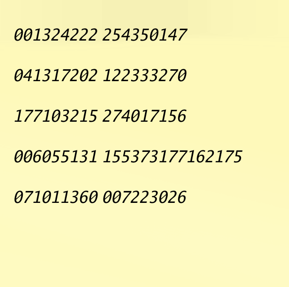

# 何これ

カードに写っている数列を特定のパターンで繋ぎ合わせて秘密鍵でデコードすると答えが取得できる cli

# 微妙なところ

ocr の精度に依存している...

# 作り始めたきっかけ

vivant が面白くて、あるワンシーンで付箋に書いてある数列をカメラで映すとあるサーバの場所がわかる的なシーンがあり
それに近いものを作りたくなったから

# windows setup

[binary install](https://github.com/UB-Mannheim/tesseract/wiki)

# mac install

```sh
export LIBRARY_PATH="/opt/homebrew/lib"
export CPATH="/opt/homebrew/include"
```

# use

```sh
vivantqr --file ./output.png --read true
vivantqr --file ./output.png --write true
```
