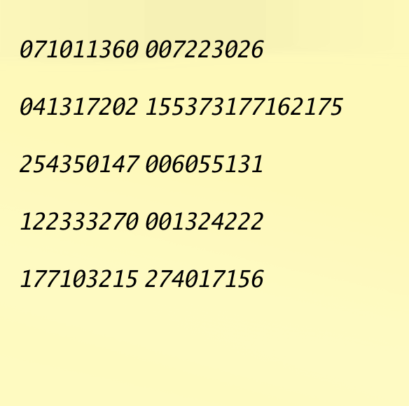

# 何これ

カードに写っている数列を特定のパターンで繋ぎ合わせて秘密鍵でデコードすると答えが取得できる cli

# 作り始めたきっかけ

vivant が面白くて、あるワンシーンで付箋に書いてある数列をカメラで映すとあるサーバの場所がわかる的なシーンがあり
それに近いものを作りたくなったから

ocr で画像の数列読み込み用の export. Windows は別で設定が必要そう

```sh
export LIBRARY_PATH="/opt/homebrew/lib"
export CPATH="/opt/homebrew/include"
```
