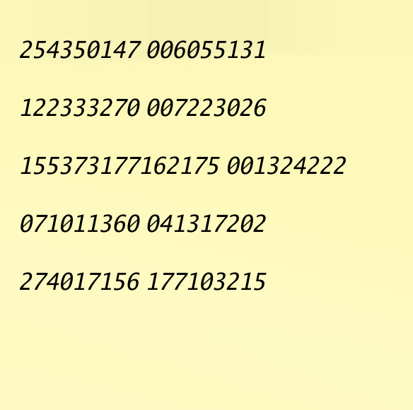

# 何これ

付箋に写っている数列を特定のパターンでしか中身の値が取得できない cli

# 微妙なところ

ocr の精度に依存している...

# 作り始めたきっかけ

vivant が面白くて、あるワンシーンで付箋に書いてある数列をカメラで映すとあるサーバの場所がわかる的なシーンがあり
それに近いものを作りたくなったから

# install

```sh
go install github.com/lll-lll-lll-lll/vivantqr/vivantqr@v1.3.1
```

# use

```sh
vivantqr --apikey=gemini_apikey --file ./output.png --read true
vivantqr --apikey=gemini_apikey --file ./output.png --write true --secret=SECRETVALUE
```
